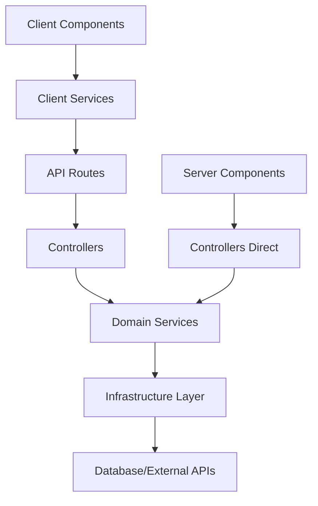

# 🚀 VAP - Vaping E-commerce Platform

> A modern, accessible e-commerce solution for selling vape devices and accessories, built with Next.js 15 and clean architecture principles.

<div align="center">


</div>

---

## 📖 Table of Contents

- [🎯 Features](#-features)
- [🏗️ Architecture](#️-architecture)
- [🚀 Getting Started](#-getting-started)
- [🌍 Internationalization](#-internationalization)
- [♿ Accessibility](#-accessibility)
- [🛠️ Tech Stack](#️-tech-stack)
- [📁 Project Structure](#-project-structure)
- [🤝 Contributing](#-contributing)
- [📄 License](#-license)

---

## 🎯 Features

### 🛒 **E-commerce Core**
- ✅ Product catalog with categories and filtering
- ✅ Shopping cart with persistent state
- ✅ User authentication (Google auth + credentials)
- ✅ Order management system
- ✅ Admin dashboard for product management

### 🎨 **User Experience**
- ✅ Responsive design with mobile-first approach
- ✅ Dark/light mode support (only light for now)
- ✅ Smooth animations and transitions
- ✅ Toast notifications

### ♿ **Accessibility First**
- ✅ WCAG 2.1 AA compliance
- ✅ Full keyboard navigation
- ✅ Screen reader optimization
- ✅ High contrast mode support
- ✅ Focus management

### 🌍 **Internationalization**
- ✅ Multi-language support (only French for now)
- ✅ Locale-based formatting

---

## 🏗️ Architecture

This project follows a **feature-first** + **clean architecture** approach for maximum maintainability and scalability.

### 🧱 **Core Principles**
- **Feature-first**: Code organized by business domains rather than technical layers
- **Clean architecture**: Clear separation of concerns with dependency inversion
- **Type safety**: Strict TypeScript with no type casting
- **Result pattern**: Functional error handling without exceptions
- **Single Responsibility**: Each component has one clear purpose

### 🔄 **Data Flow Architecture**


### 🎯 **Server vs Client Components Pattern**

This project uses a clear separation between **Server Components** and **Client Components** with dedicated data access patterns:

#### 🖥️ **Server Components** (Async Functions)
```typescript
// ✅ Server Component - Direct controller access
export const ProductsServerComponent: React.FC = async () => {
  // Server components can be async and call controllers directly
  const productListResponse = await ProductController.findProducts()
  
  if (productListResponse.status !== 200) {
    return 'Error while fetching products'
  }
  
  return <ProductList products={productListResponse.data} />
}
```

#### 🌐 **Client Components** (Interactive UI)
```typescript
'use client'

// ✅ Client Component - Use client services with hooks
export const ProductsClientComponent: React.FC = () => {
  const [productList, setProductList] = useState<ProductDTO[]>([])
  const [isLoadingProducts, setIsLoadingProducts] = useState(false)

  const loadProducts = useCallback(async () => {
    setIsLoadingProducts(true)
    // Client components use client services via API calls
    const productListResult = await ProductClient.findProducts()
    
    if (productListResult.status === 'SUCCESS') {
      setProducts(productListResult.data)
    }
    setIsLoadingProducts(false)
  }, [])

  // in server component, don't forget to add a loading.tsx file or wrap <Suspense> fallback
  if (isLoadingProducts) return <Loader />
  
  return <ProductList products={productList} />
}
```

#### 📋 **Component Pattern Guidelines**

| Component Type | Data Access | Use Cases | Benefits |
|----------------|-------------|-----------|----------|
| **Server Component** | `Controller.method()` | Static data, SEO content, Initial page loads | • Better performance<br>• SEO optimization<br>• Reduced client JS bundle |
| **Client Component** | `Client.method()` | Interactive features, User actions, Real-time updates | • Immediate user feedback<br>• Optimistic updates<br>• Rich interactions |

#### 🔧 **Implementation Examples**

**Server Component Data Fetching:**
```typescript
// app/products/page.tsx
export default async function ProductsPage({
  searchParams
}: {
  searchParams: { category?: string }
}) {
  // Direct controller call in server component
  const productsResult = await ProductController.findProducts({
    categoryId: searchParams.category
  })
  
  const categoriesResult = await CategoryController.findAll()
  
  return (
    <div>
      <ProductFilters categories={categoriesResult.value} />
      <ProductGrid products={productsResult.value} />
    </div>
  )
}
```

**Client Component with API Integration:**
```typescript
// features/product/presentation/components/product-favorites.tsx
'use client'

export function ProductFavorites() {
  const [favorites, setFavorites] = useState<Product[]>([])
  
  const toggleFavorite = useCallback(async (productId: string) => {
    // Optimistic update
    setFavorites(prev => 
      prev.some(p => p.id === productId)
        ? prev.filter(p => p.id !== productId)
        : [...prev, product]
    )
    
    // API call through client service
    const result = await ProductClient.toggleFavorite(productId)
    
    if (result.isFailure) {
      // Revert optimistic update on error
      setFavorites(prev => /* revert logic */)
      toast.error(result.error.message)
    }
  }, [])
  
  return <FavoritesList items={favorites} onToggle={toggleFavorite} />
}
```

---

## 🚀 Getting Started

### 📋 **Prerequisites**
- **Node.js** ≥ 18.17.0
- **pnpm** ≥ 8.0.0
- **PostgreSQL** ≥ 14

### ⚡ **Quick Setup**

1. **Clone the repository**
   ```bash
   git clone https://github.com/AdrienLcp/vap.git
   cd vap
   ```

2. **Install dependencies**
   ```bash
   pnpm install
   ```

3. **Environment setup**
   ```bash
   cp .env.example .env.local
   # Edit .env.local with your configuration
   ```

4. **Database setup**
   ```bash
   # Run migrations
   pnpx prisma migrate dev
   ```

5. **Start development server**
   ```bash
   pnpm dev
   ```

   Open [http://localhost:3000](http://localhost:3000) in your browser.

### 🔧 **Available Scripts**

| Command | Description |
|---------|-------------|
| `pnpm dev` | Start development server with Turbopack |
| `pnpm build` | Build for production |
| `pnpm lint` | Run ESLint |

---

## 🌍 Internationalization

The project supports multiple languages using a custom i18n implementation.

### 🗺️ **Supported Locales**
- 🇫🇷 **French** (default)

### 📝 **Adding Translations**

1. **Add dictionary files**
   ```
   src/infrastructure/i18n/dictionaries/
   └── fr.ts
   ```

2. **Use in components**
   ```typescript
   import { t } from '@/infrastructure/i18n'
   
   export const MyComponent: React.FC = () => {
     return <h1>{t('welcome.title')}</h1>
   }
   ```

---

## ♿ Accessibility

This project prioritizes accessibility using **React Aria Components** and follows WCAG 2.1 AA guidelines.

### 🎯 **Key Features**
- **Semantic HTML**: Proper heading hierarchy and landmarks
- **Keyboard Navigation**: Full keyboard accessibility
- **Screen Readers**: Comprehensive ARIA labels and descriptions
- **Focus Management**: Logical focus order and visual indicators
- **Color Contrast**: Meets AAA standards where possible

### 🧪 **Testing Accessibility**
```bash
# Run with screen reader
# Use NVDA (Windows), VoiceOver (macOS), or Orca (Linux)

# Keyboard-only navigation
# Tab through all interactive elements

# Color contrast validation
# Use browser dev tools or axe extension
```

---

## 🛠️ Tech Stack

### 🔧 **Core Framework**
- **Next.js 15.5.4** - React framework with App Router
- **React 19.1.1** - UI library with Server Components
- **TypeScript 5.9.2** - Type safety and developer experience

### 🎨 **Styling & UI**
- **SASS 1.93.2** - CSS preprocessor with modular architecture
- **React Aria Components 1.12.2** - Accessible UI primitives
- **Lucide React 0.544.0** - Beautiful icons
- **Classnames 2.5.1** - Conditional CSS classes

### 🔐 **Authentication & Security**
- **Better Auth 1.3.17** - Modern authentication library
- **js-sha256 0.11.1** - Cryptographic hashing
- **Zod 4.1.11** - Runtime type validation

### 🗄️ **Database & Backend**
- **Prisma 6.16.2** - Type-safe database ORM
- **PostgreSQL** - Primary database
- **Server-only 0.0.1** - Server-side code protection

### �️ **Development Tools**
- **ESLint 9.36.0** - Code linting and formatting
- **TypeScript ESLint 8.44.1** - TypeScript-specific linting
- **Turbopack** - Fast development bundler

### 🌐 **Infrastructure**
- **T3 Env 0.13.8** - Environment variable validation
- **Custom i18n** - Internationalization system

---

## 📁 Project Structure

```
vap/
├── 📁 prisma/                    # Database schema & migrations
│   ├── schema.prisma
│   └── migrations/
├── 📁 src/
│   ├── 📁 app/                   # Next.js App Router
│   │   ├── layout.tsx
│   │   ├── page.tsx
│   │   ├── 📁 api/               # API routes
│   │   ├── 📁 auth/              # Auth pages
│   │   └── 📁 admin/             # Admin dashboard
│   │
│   ├── 📁 features/              # Business features (Clean Architecture)
│   │   ├── 📁 auth/              # Authentication feature
│   │   │   ├── 📁 domain/        # Auth business logic
│   │   │   ├── 📁 application/   # Auth use cases
│   │   │   ├── 📁 infrastructure/# Auth external services
│   │   │   └── 📁 presentation/  # Auth UI components
│   │   │
│   │   ├── 📁 product/           # Product management
│   │   ├── 📁 cart/              # Shopping cart
│   │   ├── 📁 category/          # Product categories
│   │   ├── 📁 user/              # User management
│   │   └── 📁 admin/             # Admin functionality
│   │
│   ├── 📁 domain/                # Shared business entities
│   │   ├── entities.ts           # Core business types
│   │   └── navigation.ts         # Navigation structure
│   │
│   ├── 📁 infrastructure/        # Technical services
│   │   ├── 📁 api/               # HTTP client & utilities
│   │   ├── 📁 database/          # Database helpers
│   │   ├── 📁 env/               # Environment validation
│   │   ├── 📁 i18n/              # Internationalization
│   │   └── 📁 storage/           # Local storage utilities
│   │
│   ├── 📁 presentation/          # Shared UI layer
│   │   ├── 📁 components/        # Reusable components
│   │   │   ├── 📁 ui/            # Base UI components
│   │   │   └── 📁 forms/         # Form components
│   │   ├── 📁 hooks/             # Custom React hooks
│   │   ├── 📁 services/          # UI services (toast, etc.)
│   │   ├── 📁 styles/            # Global SASS styles
│   │   └── 📁 utils/             # UI utilities
│   │
│   ├── 📁 helpers/               # Shared utilities
│   │   └── result.ts             # Result pattern implementation
│   │
│   └── 📁 utils/                 # General utilities
│       ├── array-utils.ts
│       ├── format-utils.ts
│       ├── object-utils.ts
│       └── validation-utils.ts
│
├── 📄 package.json               # Dependencies & scripts
├── 📄 tsconfig.json              # TypeScript configuration
├── 📄 next.config.ts             # Next.js configuration
├── 📄 eslint.config.mjs          # ESLint configuration
└── 📄 README.md                  # Project documentation
```

### 🏛️ **Feature Architecture Example**

Each feature follows clean architecture principles with clear separation between server and client data access:

```
features/product/
├── 📁 domain/
│   ├── product-constants.ts      # Product constants & enums
│   ├── product-entities.ts       # Product business entities
│   └── product-schemas.ts        # Zod validation schemas
├── 📁 application/
│   ├── hooks/                    # Client-side React hooks
│   └── product-service.ts        # Core business logic
├── 📁 infrastructure/
│   ├── product-repository.ts     # Database layer (Prisma)
│   └── product-client.ts         # 🌐 Client API service
└── 📁 presentation/
    ├── components/               # React UI components
    ├── hooks/                    # UI-specific hooks
    └── product-controller.ts     # 🖥️ Server controller
```

#### 🔍 **Controller vs Client Pattern**

```typescript
// 🖥️ Server Controller (presentation/product-controller.ts)
export class ProductController {
  static async findProducts(params?: ProductFilters): Promise<Result<Product[], Error>> {
    // Direct access to application services in server components
    return await ProductService.findProducts(params)
  }
  
  static async findById(id: string): Promise<Result<Product, Error>> {
    return await ProductService.findById(id)
  }
}

// 🌐 Client Service (infrastructure/product-client.ts) 
export class ProductClient {
  static async findProducts(params?: ProductFilters): Promise<Result<Product[], Error>> {
    // HTTP calls to API routes for client components
    const response = await ApiClient.get('/api/products', { params })
    return Result.fromApiResponse(response)
  }
  
  static async toggleFavorite(productId: string): Promise<Result<void, Error>> {
    const response = await ApiClient.post(`/api/products/${productId}/favorite`)
    return Result.fromApiResponse(response)
  }
}
```

#### 📱 **Usage in Components**

**Server Component Example:**
```typescript
// app/products/[id]/page.tsx
export default async function ProductPage({ params }: { params: { id: string } }) {
  // ✅ Use Controller in Server Components
  const result = await ProductController.findById(params.id)
  
  if (result.isFailure) {
    notFound()
  }
  
  return <ProductDetail product={result.value} />
}
```

**Client Component Example:**
```typescript
// features/product/presentation/components/product-favorites-button.tsx
'use client'

export function ProductFavoritesButton({ productId }: { productId: string }) {
  const [isFavorite, setIsFavorite] = useState(false)
  
  const handleToggle = useCallback(async () => {
    // ✅ Use Client in Client Components
    const result = await ProductClient.toggleFavorite(productId)
    
    if (result.isSuccess) {
      setIsFavorite(!isFavorite)
    }
  }, [productId, isFavorite])
  
  return (
    <Button onPress={handleToggle}>
      {isFavorite ? <HeartFilled /> : <Heart />}
    </Button>
  )
}
```

---

## 🤝 Contributing

We welcome contributions! Please follow these guidelines:

### 🔄 **Development Workflow**

1. **Fork & Clone**
   ```bash
   git clone https://github.com/AdrienLcp/vap.git
   ```

2. **Create Feature Branch**
   ```bash
   git checkout -b feature/amazing-feature
   ```

3. **Follow Code Standards**
   - Use TypeScript strictly (no `any` types)
   - Follow clean architecture principles
   - Add tests for new features
   - Ensure accessibility compliance

4. **Commit Convention**
   ```bash
   git commit -m "feat: add amazing feature"
   # Types: feat, fix, docs, style, refactor, test, chore
   ```

5. **Submit Pull Request**
   - Describe changes clearly
   - Include screenshots for UI changes
   - Ensure all tests pass

### 📏 **Code Standards**

- **No type casting** - Use proper TypeScript types
- **Result pattern** - Use `Result<T, E>` for error handling
- **Single Responsibility** - One concern per component/function
- **Accessibility first** - Always consider screen readers and keyboard navigation
- **Feature architecture** - Organize by business domain, not technical layers

---

<div align="center">

**Made with ❤️ by [Adrien Lacourpaille](https://github.com/AdrienLcp)**

*Building accessible, modern e-commerce experiences*

</div>
